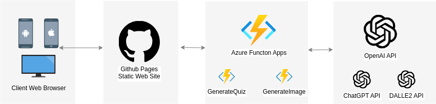

# GPTeasers 🧠💡

Welcome to **GPTeasers** - where we tickle your brain with quizzes from the depths of GPT's knowledge! 🎓🤖

https://djsaunders1997.github.io/GPTeasers/

## Overview 🌐

GPTeasers is a webapp that generates quiz-style questions based on the topic you provide. Want to challenge yourself with "Roman History" or dive deep into "Quantum Physics"? We've got you covered! 📚✨

## Features 🌟

- **Dynamic Quizzes** 📝: Enter a topic and get a quiz in seconds!
- **Instant Feedback** 💬: Know right away if you're a genius or if it's time to hit the books.
- **Mobile Friendly** 📱: Quiz yourself anytime, anywhere.
- **Hosted on GitHub Pages** 🚀: Fast, reliable, and free!

## How to Use 🛠️

1. **Visit the App** 🌍: Go to the [GPTeasers site](https://djsaunders1997.github.io/GPTeasers/).
2. **Enter a Topic** 🔍: Type in your desired topic in the search box.
3. **Start the Quiz** 🎉: Answer the questions and see how you fare!
4. **Share & Challenge Friends** 🤝: Think you did well? Share your results and challenge a friend!

# Architecture

1. Web Browser (Client): The user accesses the static site hosted on GitHub Pages.
2. GitHub Pages (Static Site): The static site serves content to the client. When specific actions are taken on the site (pressing a Generate Quz button), a call is made to the Azure Functions Backend.
3. Azure Functions: Once triggered, the Azure Functions communicates with the OpenAI API, sending requests and receiving responses.
4. OpenAI API: Processes the request from the Azure Function and sends back a response.

## Contribute 🤲

Love **GPTeasers**? Want to make it even better? We welcome contributions!

1. **Fork** this repo 🍴.
2. Make your changes 🛠️.
3. Submit a **pull request** 👥.

