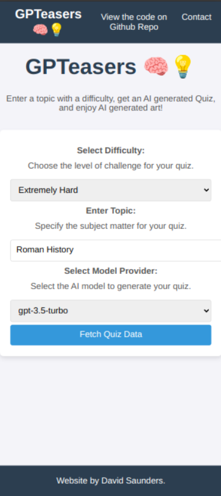

[](https://github.com/DJSaunders1997/GPTeasers/actions/workflows/static.yml)
[](https://github.com/DJSaunders1997/GPTeasers/actions/workflows/gpteasers-AutoDeployTrigger-f53ae13c-780c-4431-b28c-18728d5a7dd7.yml)
[](https://github.com/DJSaunders1997/GPTeasers/actions/workflows/github-code-scanning/codeql)

# GPTeasers 🧠💡

Welcome to GPTeasers – a quiz app that challenges your brain with dynamically generated questions. Whether you’re into Roman History or Quantum Physics, GPTeasers has you covered. We even let you choose from multiple AI providers, so you can experience different styles of quiz generation.

https://djsaunders1997.github.io/GPTeasers/

## Overview

GPTeasers is a straightforward web app that creates quiz-style questions based on topics you select. Simply enter a subject you're curious about, and our system will generate a quiz just for you using advanced AI. With support for multiple AI providers.

<table>
<tr>
<td width="50%">

### Front Page



</td>
<td width="50%">

### Quiz Page


</td>
</tr>
</table>

## Features

- **Dynamic Quizzes**: Input any topic and receive a quiz in seconds using genAI.
- **Multiple AI Providers**: Select from a range of AI services to get different quiz styles.
- **Hosted on GitHub Pages**: Fast, reliable, and free.

## How to Use

1. **Visit the App**: Go to the [GPTeasers site](https://djsaunders1997.github.io/GPTeasers/).
2. **Enter a Topic**: Type in your desired topic.
3. **Start the Quiz**: Answer the questions and see your results.
4. **Share & Challenge Friends**: Think you aced it? Share your score and challenge your friends!

### AI Providers

<div>
    <table>
        <tr align="center">
            <td width="25%">
                <br>
                <b>OpenAI</b><br>
                <small>GPT Models</small>
            </td>
            <td width="25%">
                <br>
                <b>Gemini</b><br>
                <small>Google AI</small>
            </td>
            <td width="25%">
                <br>
                <b>Azure AI</b><br>
                <small>Enterprise AI</small>
            </td>
            <td width="25%">
                <br>
                <b>DeepSeek</b><br>
                <small>R1 Models</small>
            </td>
        </tr>
    </table>
</div>

# Architecture

## Original Architecture Diagram


## Interactive System Overview

```mermaid
graph TB
    %% User Layer
    User[👤 User]
    Browser[🌐 Web Browser]

    %% Frontend Layer
    GHP[📄 GitHub Pages<br/>Static Frontend<br/>HTML/CSS/JS]

    %% Backend Layer
    subgraph ACA[☁️ Azure Container Apps]
        subgraph Docker[🐳 Docker Container]
            FastAPI[⚡ FastAPI Backend]
        end
    end

    %% AI Providers
    subgraph AI_Providers[🤖 AI Providers]
        subgraph OpenAI[OpenAI]
            GPT35[gpt-3.5-turbo]
            GPT4[gpt-4-turbo]
            O3[o3-mini]
        end
        subgraph Google[Google]
            Gemini2[gemini-2.0-flash]
        end
        subgraph Microsoft[Microsoft Azure AI]
            DeepSeekR1[DeepSeek-R1]
        end
    end

    %% Image Generation
    subgraph ImageGen[🎨 Image Generation]
        subgraph OpenAI_Images[OpenAI]
            DALLE[DALL-E 3]
        end
    end

    %% Data Flow
    User --> Browser
    Browser --> GHP
    GHP -.->|SSE Connection| ACA
    FastAPI -->|/GenerateQuiz Endpoint| AI_Providers
    FastAPI -->|/GenerateImage Endpoint| ImageGen

    %% Styling - Only color AI model sub-boxes
    classDef openai fill:#a7f3d0,stroke:#059669,stroke-width:2px,color:#000
    classDef gemini fill:#bfdbfe,stroke:#2563eb,stroke-width:2px,color:#000
    classDef azure fill:#bfdbfe,stroke:#1d4ed8,stroke-width:2px,color:#000
    classDef deepseek fill:#ddd6fe,stroke:#7c3aed,stroke-width:2px,color:#000

    class GPT35,GPT4,O3 openai
    class Gemini2 gemini
    class DeepSeekR1 deepseek
    class DALLE openai
```



## Component Flow


### Architecture Components

1. **Web Browser (Client)**: The user interact with a static site hosted on GitHub Pages.
2. **GitHub Pages (Static Site)**: Delivers the site's content. When you hit "Generate Quiz", the site communicates with our backend.
3. **Azure Container Apps**: The FastAPI backend processes your quiz request and works with different AI providers.
4. **AI Providers**: Multiple AI services process your input and generate unique quiz questions.

## Docker Compose Setup for Local Testing

This project uses Docker Compose to run both the FastAPI backend and the frontend services locally.

### Services

- **fastapi_generate_quiz**:  
  The FastAPI backend handles quiz generation by interacting with various AI providers.

- **frontend**:  
  A static version of the front end for local testing (even though the production site is on GitHub Pages).

### Running Locally

1. **Set Environment Variables**  
   Make sure your API keys are set in your environment or in a `.env` file at the project root:

   ```sh
   export OPENAI_API_KEY=your_openai_api_key_here
   export GEMINI_API_KEY=your_gemini_api_key_here
   export AZURE_AI_API_KEY=your_azure_ai_api_key_here
   export AZURE_AI_API_BASE=your_azure_ai_api_base_here
   export DEEPSEEK_API_KEY=your_deepseek_api_key_here
   # ... other API keys
   ```

   Or create a `.env` file with:

   ```
   OPENAI_API_KEY=your_openai_api_key_here
   GEMINI_API_KEY=your_gemini_api_key_here
   AZURE_AI_API_KEY=your_azure_ai_api_key_here
   AZURE_AI_API_BASE=your_azure_ai_api_base_here
   DEEPSEEK_API_KEY=your_deepseek_api_key_here
   # ... other API keys
   ```

2. **Build and Run with Docker Compose**  
   From the project root, run:

   ```sh
   docker-compose up --build
   ```

   This command builds and starts both the backend and frontend containers.

3. **Alternative: Run Backend Locally with UV**  
   For faster development iteration:

   ```sh
   cd backend
   uv sync --dev
   uv run uvicorn fastapi_generate_quiz:app --reload --host 0.0.0.0 --port 8000
   ```

4. **Access the Services**
   - **Backend API (FastAPI)**: [http://localhost:8000](http://localhost:8000)
   - **Frontend**: [http://localhost:8080](http://localhost:8080)

With these steps, you can easily test both the backend API and the static frontend locally using Docker Compose or UV for faster backend development.
