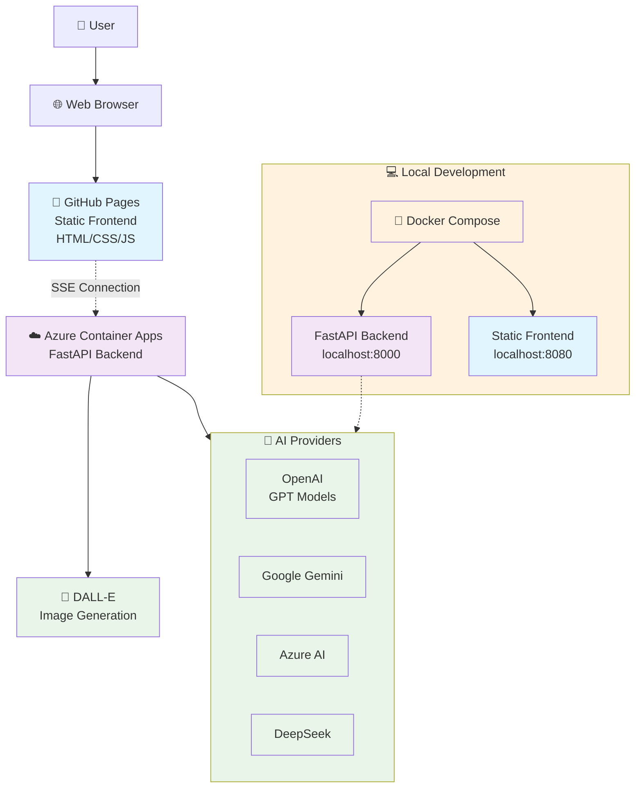
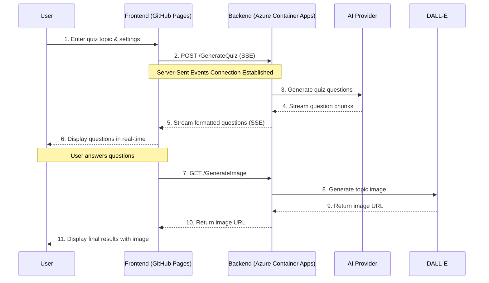
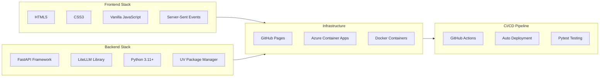
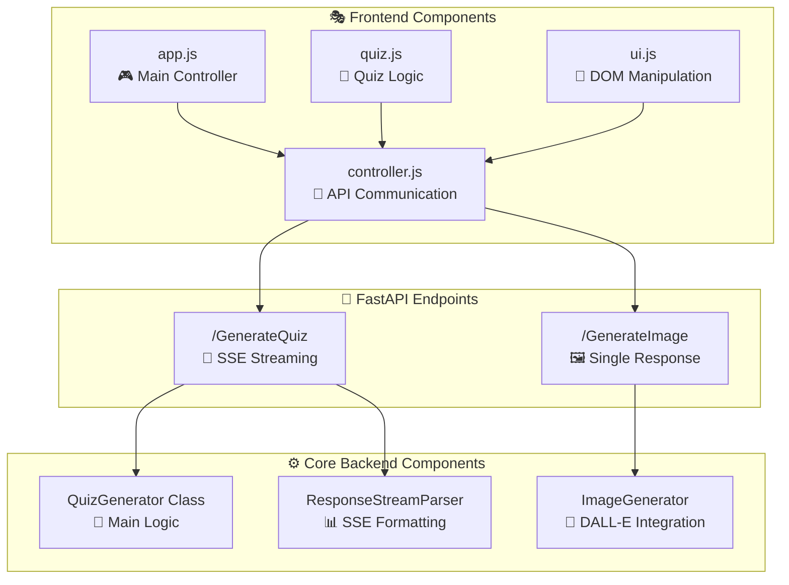
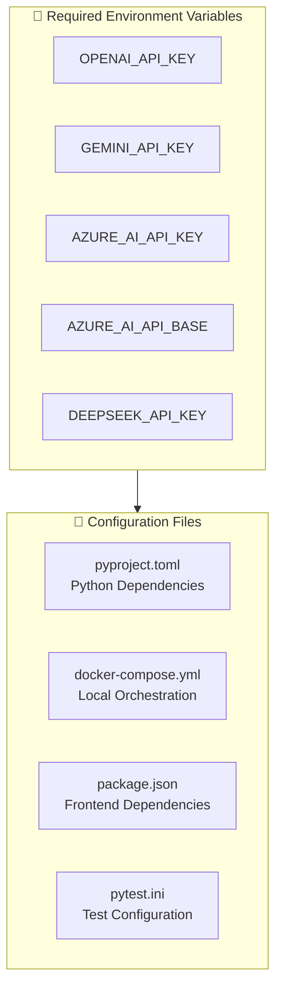

# GPTeasers Architecture Diagram

## System Overview

```mermaid
graph TB
    %% User Layer
    User[👤 User]
    Browser[🌐 Web Browser]
    
    %% Frontend Layer
    GHP[📄 GitHub Pages<br/>Static Frontend<br/>HTML/CSS/JS]
    
    %% Backend Layer
    ACA[☁️ Azure Container Apps<br/>FastAPI Backend]
    
    %% AI Providers
    subgraph AI_Providers[🤖 AI Providers]
        OpenAI[OpenAI<br/>GPT Models]
        Gemini[Google Gemini]
        AzureAI[Azure AI]
        DeepSeek[DeepSeek]
    end
    
    %% Image Generation
    DALLE[🎨 DALL-E<br/>Image Generation]
    
    %% Development Environment
    subgraph Local_Dev[💻 Local Development]
        Docker[🐳 Docker Compose]
        Backend_Local[FastAPI Backend<br/>localhost:8000]
        Frontend_Local[Static Frontend<br/>localhost:8080]
    end
    
    %% Data Flow
    User --> Browser
    Browser --> GHP
    GHP -.->|SSE Connection| ACA
    ACA --> AI_Providers
    ACA --> DALLE
    
    %% Local Development Flow
    Docker --> Backend_Local
    Docker --> Frontend_Local
    Backend_Local -.-> AI_Providers
    
    %% Styling
    classDef frontend fill:#e1f5fe
    classDef backend fill:#f3e5f5
    classDef ai fill:#e8f5e8
    classDef local fill:#fff3e0
    
    class GHP,Frontend_Local frontend
    class ACA,Backend_Local backend
    class AI_Providers,OpenAI,Gemini,AzureAI,DeepSeek,DALLE ai
    class Docker,Local_Dev local
```

## Detailed Component Flow

```mermaid
sequenceDiagram
    participant U as User
    participant F as Frontend (GitHub Pages)
    participant B as Backend (Azure Container Apps)
    participant AI as AI Provider
    participant IMG as DALL-E
    
    U->>F: 1. Enter quiz topic & settings
    F->>B: 2. POST /GenerateQuiz (SSE)
    
    Note over F,B: Server-Sent Events Connection Established
    
    B->>AI: 3. Generate quiz questions
    AI-->>B: 4. Stream question chunks
    B-->>F: 5. Stream formatted questions (SSE)
    F-->>U: 6. Display questions in real-time
    
    Note over U,F: User answers questions
    
    F->>B: 7. GET /GenerateImage
    B->>IMG: 8. Generate topic image
    IMG-->>B: 9. Return image URL
    B-->>F: 10. Return image URL
    F-->>U: 11. Display final results with image
```

## Technology Stack & Key Components

```mermaid
graph LR
    subgraph Frontend_Tech[Frontend Stack]
        HTML[HTML5]
        CSS[CSS3]
        JS[Vanilla JavaScript]
        SSE[Server-Sent Events]
    end
    
    subgraph Backend_Tech[Backend Stack]
        FastAPI[FastAPI Framework]
        LiteLLM[LiteLLM Library]
        Python[Python 3.11+]
        UV[UV Package Manager]
    end
    
    subgraph Infrastructure[Infrastructure]
        GH_Pages[GitHub Pages]
        AZ_Container[Azure Container Apps]
        Docker[Docker Containers]
    end
    
    subgraph CI_CD[CI/CD Pipeline]
        GH_Actions[GitHub Actions]
        Auto_Deploy[Auto Deployment]
        Testing[Pytest Testing]
    end
    
    Frontend_Tech --> Infrastructure
    Backend_Tech --> Infrastructure
    Infrastructure --> CI_CD
```

## API Endpoints & Data Flow

```mermaid
graph TD
    subgraph API_Endpoints[🔗 FastAPI Endpoints]
        Gen_Quiz["/GenerateQuiz<br/>📡 SSE Streaming"]
        Gen_Image["/GenerateImage<br/>🖼️ Single Response"]
    end
    
    subgraph Core_Components[⚙️ Core Backend Components]
        QuizGen["QuizGenerator Class<br/>🧠 Main Logic"]
        StreamParser["ResponseStreamParser<br/>📊 SSE Formatting"]
        ImageGen["ImageGenerator<br/>🎨 DALL-E Integration"]
    end
    
    subgraph Frontend_Components[🎭 Frontend Components]
        App["app.js<br/>🎮 Main Controller"]
        Controller["controller.js<br/>📡 API Communication"]
        Quiz["quiz.js<br/>🧩 Quiz Logic"]
        UI["ui.js<br/>🎨 DOM Manipulation"]
    end
    
    Gen_Quiz --> QuizGen
    Gen_Quiz --> StreamParser
    Gen_Image --> ImageGen
    
    Controller --> Gen_Quiz
    Controller --> Gen_Image
    App --> Controller
    Quiz --> Controller
    UI --> Controller
```

## Environment Variables & Configuration

```mermaid
graph TB
    subgraph Env_Vars[🔐 Required Environment Variables]
        OPENAI[OPENAI_API_KEY]
        GEMINI[GEMINI_API_KEY]  
        AZURE_AI_KEY[AZURE_AI_API_KEY]
        AZURE_AI_BASE[AZURE_AI_API_BASE]
        DEEPSEEK[DEEPSEEK_API_KEY]
    end
    
    subgraph Config_Files[📁 Configuration Files]
        PyProject[pyproject.toml<br/>Python Dependencies]
        Docker_Compose[docker-compose.yml<br/>Local Orchestration]
        Package_JSON[package.json<br/>Frontend Dependencies]
        Pytest_INI[pytest.ini<br/>Test Configuration]
    end
    
    Env_Vars --> Config_Files
```