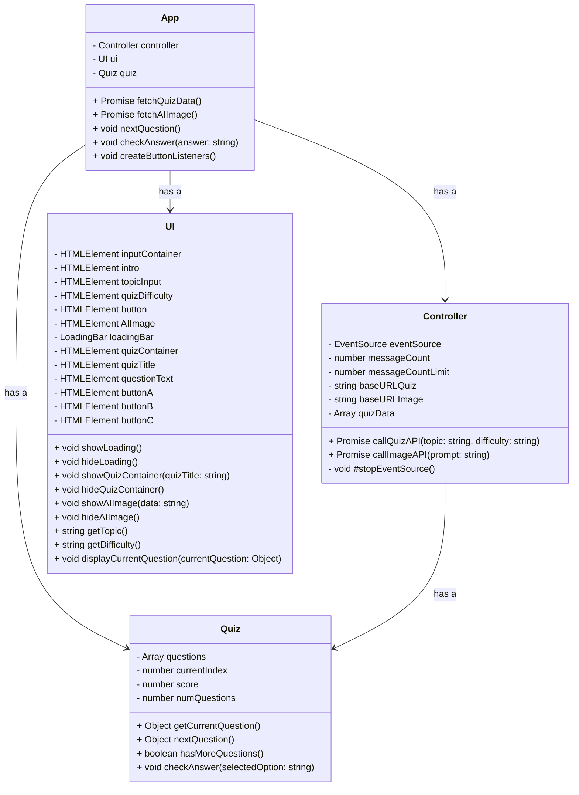

# Frontend Directory

This app is a single static HTML webpage hosted with GitHub Pages.
The .js files control dynamic logic, and calling the backend.

## Directory Structure

```
.
├── scripts
│   ├── app.js              # Main application logic
│   ├── controller.js       # Backend API interaction
│   ├── quiz.js             # Quiz related logic
│   ├── loadingbar.js       # Loading bar animation
│   └── ui.js               # User Interface related
├── static
│   ├── index.html          # Main HTML page for the GPTeasers Quiz App
│   └── styles.css          # CSS file for styling
```

## File Descriptions

### `app.js`

This file contains the main logic for the GPTeasers Quiz App. 
It manages the fetching of quiz data from the API and its presentation on the web page. 
It also handles user interactions, such as clicking the "Fetch Quiz Data" button and input validation.

### `controller.js`

This class is responsible for interacting with the backend API. 
It contains methods to call the Quiz API based on a given topic and processes the API response.

### `quiz.js`

The Quiz class contains methods related to quiz logic, 
such as parsing quiz data, checking answers, calculating scores, etc.

### `index.html`

The main HTML page for the GPTeasers Quiz App. 
This page provides a UI for users to input a quiz topic, fetch quiz data, and interact with the fetched quiz.

### `loadingbar.js`

This class represents a loading bar. 
It provides methods to start and stop a loading bar animation, which gives users feedback during longer operations.

### `ui.js`

The UI class provides methods related to the user interface. 
It contains methods to show/hide loading animations, 
display fetched quiz data on the web page, and manipulate other UI elements based on user interactions and quiz logic.

## Setup and Usage

1. Open `index.html` in a modern web browser, or use the `Live Server` VSCode extension.
2. Enter a quiz topic in the provided input field.
3. Click the "Fetch Quiz Data" button.
4. The app will fetch quiz data related to the given topic and display it on the page.

## Dockerfile for Local Testing

This Dockerfile is used to containerize the frontend static site for local testing.
It copies all static files into a container running a lightweight web server so that you can test the site locally.

- **Nginx Option:**  
  The Dockerfile uses the official Nginx image to serve the static files on port 80.

- **http-server Option:**  
  Alternatively, the Dockerfile can use a Node.js image with http-server to serve the files on a specified port.

Refer to the Docker Compose file at the project root to build and run the container.

## UML


